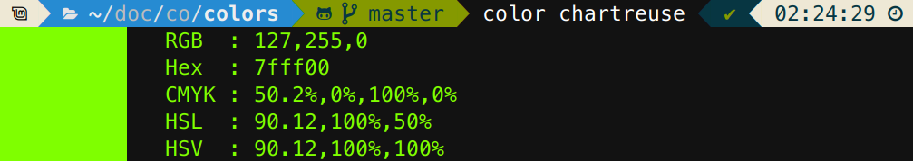

# color.c - A Color Printing and Conversion Tool
[](https://github.com/FlamingLeo/color.c/actions/workflows/run-tests.yml)



`color.c` is a command-line tool designed for terminals with 24-bit color support which automatically parses the input color, displays it and shows a list of conversions to other common color models.

## Usage and Formats
**Usage**: `color [-c <model>] [-f <n>] [-h] [-j] [-l [0|1]] [-m <map>] [-p] [-w <n>] [-W] [-x] <color> <color>`

Following options are supported:
```text
-c <model>: only show the conversion of the chosen color to the specified model, then exit
-f <0..5> : choose the maximum amount of decimal places to print (default: 2)
-h        : show this help text and exit
-j        : print output in json format
-l [0 | 1]: show a list of currently supported named colors and exit (default: 0)
   - 0: human-readable format with sample, name and hex color
   - 1: csv output with headers "name", "color", no sample
-m <map>  : map terminal color to 0-, 16-, 256- or true color output (default: your terminal's color mode)
            you may try and force unsupported terminals render higher color modes
-p        : disable coloring text output (plain, for hard-to-read colors) (default: true)
-w <0..25>: choose the width of the left color square to display (h = w / 2) (default: 14)
-x        : use xkcd color names instead of css (default: false)
            this option must be set if you want to parse an xkcd color name
-z        : print colors in web format (css) (default: false)
```

> [!TIP]
> Use `-w 0` to disable the color block or `-d 0` to round to the nearest integer.

Following color models and input formats are supported (case-insensitive, whitespace allowed):
- **Named**: Any valid named [CSS](https://github.com/bahamas10/css-color-names/blob/master/css-color-names.json) / [XKCD](https://xkcd.com/color/rgb/) color will work.
- **RGB** (`r`, `g`, `b` between 0 and 255 as integers or between 0.0 and 1.0 as floats): 
    - `rgb(r,g,b)`
    - `r,g,b`
- **Hex** (including shorthand `rgb` and `hex(...)` variants; `r`, `g`, `b` between `0` and `F`):
    - `#rrggbb`
    - `0xrrggbb`
    - `xrrggbb`
    - `rrggbb`
- **CMYK** (`c`, `m`, `y`, `k` between 0.0 and 100.0):
    - `cmyk(c%,m%,y%,k%)`
    - `cmyk(c,m,y,k)`
    - `c%,m%,y%,k%`
    - `c,m,y,k`
- **HSL** (`h` mod 360, `s`, `l` between 0.0 and 100.0):
    - `hsl(h,s%,l%)`
    - `hsl(h,s,l)`
- **HSV** (`h` mod 360, `s`, `v` between 0.0 and 100.0):
    - `hsv(h,s%,v%)`
    - `hsv(h,s,v)`
    - `h,s%,v%`

Read more about the supported formats here: [RGB](https://en.wikipedia.org/wiki/RGB_color_model), [Hex](https://en.wikipedia.org/wiki/Web_colors), [CMYK](https://en.wikipedia.org/wiki/CMYK_color_model), [HSL and HSV](https://en.wikipedia.org/wiki/HSL_and_HSV).

> [!NOTE]  
> A simple triplet will be parsed as RGB. To differentiate between RGB and HSV, percentage symbols are needed for saturation and value. Because HSL and HSV have the same structure from the parser's point of view, a triplet where the last two contain percentages will be parsed as HSV.

> [!IMPORTANT]  
> XKCD names have had whitespaces removed to not break existing functionality. To separate between `darkgreen` and `dark green`, the latter was changed to `dark-green`.

## Build and  Installation
**Usage**: `./install.sh [name]`

The repository provides a simple shell script for Linux which builds the program and installs (copies) it to `/usr/local/bin`. You may provide an optional `name` argument to install the binary under a different name, to prevent clashing with another program (the name is pretty basic, after all).

Alternatively, you can just build the executable in the root directory of the repository using `make`. Unit tests are available using `make test`.

## License (?)
[Do whatever you want](https://en.wikipedia.org/wiki/WTFPL), I don't know, I'm not good at this legal stuff anyway.
