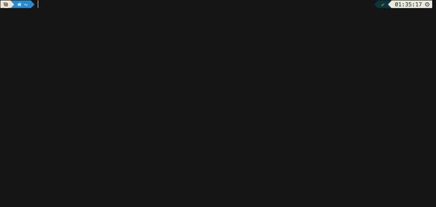

# color.c - A Color Printing and Conversion Tool
[](https://github.com/FlamingLeo/color.c/actions/workflows/run-tests.yml)



`color.c` is a command-line tool designed for terminals with 24-bit color support[^1] which automatically parses the input color, displays it and shows a list of conversions to other common color models.

[^1]: For non-truecolor terminals, colorless and 16-/256-color mappings are available. This program also respects the [`NO_COLOR`](https://no-color.org/) environment variable.

## Features
- **Default**: Show a preview of the chosen color and conversions to different color models.
    - Example: `color -W periwinkle` (periwinkle, sample w/ conversions, CSS format)
- **Difference**: Show previews and the color difference between two colors.
    - Example: `color -d 0xABC -D oklab 0x123`(distance between `#aabbcc` and `#112233` using Oklab)
- **Contrast**: Show previews and the WCAG contrast between two colors.
    - Example: `color -C lime green` (contrast between `lime` and `green`, fore- and background)
- **Conversion**: Convert a color to a specific color model.
    - Example: `cccccccccc` (convert `rgb(17,243,98)` to `cmyk(93%,0%,59.67%,4.71%)`)
- **JSON**: Get the results of any operation as ready-to-parse JSON output.
    - Example: `color -j -d red -c hex 255,0,192` (distance between `red` and `rgb(255,0,192)`, both numbers converted to hexadecimal, as JSON output)
- **List**: Get a list of all supported named colors and their color codes.
    - Example: `color -x -c oklch -l` (all named XKCD colors, Oklch)

## Usage and Formats
**Usage**: `color [-c <model>] [-C <color>] [-d <color>] [-D <cdiff>] [-f <n>] [-h] [-j] [-l [0|1]] [-m <map>] [-p] [-w <n>] [-W] [-x] <color> <color>`

Following options are supported:
```text
-c <model>: only show the conversion of the chosen color to the specified model, then exit
-C <color>: choose a color to compute the contrast against
-d <color>: choose a color to compute the difference with
-D <cdiff>: choose color difference method: rgb | wrgb / weighted | oklab | all (default: all)
-f <0..5> : choose the maximum amount of decimal places to print (default: 2)
-h        : show this help text and exit
-j        : print output in json format
-l [0 | 1]: show a list of currently supported named colors and exit (default: 0)
   - 0: human-readable format with sample, name and hex color
   - 1: csv output with headers "name", "color", no sample
-m <map>  : map terminal color to 0-, 16-, 256- or true color output (default: your terminal's color mode)
            you may try and force unsupported terminals render higher color modes
-p        : disable coloring text output (plain, for hard-to-read colors) (default: true)
-w <0..25>: choose the width of the left color square to display (h = w / 2) (default: 18)
-x        : use xkcd color names instead of css (default: false)
            this option must be set if you want to parse an xkcd color name
-z        : print colors in web format (css) (default: false)
```
> [!NOTE]  
> Options are parsed from left to right, and additional options after ones which alter regular program flow (e.g. `-l`) won't be processed. For example, `-W -c rgb -j -l` will list colors in CSS RGB format as JSON, but `-l -W -c rgb -j` will only perform default, non-JSON hexadecimal listing.

> [!TIP]
> Use `-w 0` to disable the color block or `-d 0` to round to the nearest integer.

Following color models and input formats are supported (case-insensitive, whitespace allowed):
- **Named**: Any valid named [CSS](https://github.com/bahamas10/css-color-names/blob/master/css-color-names.json) / [XKCD](https://xkcd.com/color/rgb/) color will work.
- **RGB** (`r`, `g`, `b` between 0 and 255 as integers or between 0.0 and 1.0 as floats): 
    - `rgb(r,g,b)`
    - `r,g,b`
- **Hex** (including shorthand `rgb` and `hex(...)` variants; `r`, `g`, `b` between `0` and `F`):
    - `#rrggbb`
    - `0xrrggbb`
    - `xrrggbb`
    - `rrggbb`
- **CMYK** (`c`, `m`, `y`, `k` between 0.0 and 100.0):
    - `cmyk(c%,m%,y%,k%)`
    - `cmyk(c,m,y,k)`
    - `c%,m%,y%,k%`
    - `c,m,y,k`
- **HSL** (`h` mod 360, `s`, `l` between 0.0 and 100.0):
    - `hsl(h,s%,l%)`
    - `hsl(h,s,l)`
- **HSV** (`h` mod 360, `s`, `v` between 0.0 and 100.0):
    - `hsv(h,s%,v%)`
    - `hsv(h,s,v)`
    - `h,s%,v%`
- **Oklab** (`L` between 0.0 and 100.0, `a`, `b` any float)
    - `oklab(L,a,b)` (optional percent signs for each component)
- **Oklch** (`L`, `c` between 0.0 and 100.0, `h` mod 360)
    - `oklch(L,c,h)` (optional percent signs for `L` and `c`)
    - `L%,c,h`
    - `L%,c%,h`

Read more about the supported formats here: [RGB](https://en.wikipedia.org/wiki/RGB_color_model), [Hex](https://en.wikipedia.org/wiki/Web_colors), [CMYK](https://en.wikipedia.org/wiki/CMYK_color_model), [HSL / HSV](https://en.wikipedia.org/wiki/HSL_and_HSV), [Oklab / Oklch](https://en.wikipedia.org/wiki/Oklab_color_space).

> [!NOTE]  
> A simple triplet will be parsed as RGB. To differentiate between RGB and HSV, percentage symbols are needed for saturation and value. Because HSL and HSV have the same structure from the parser's point of view, a triplet where the last two contain percentages will be parsed as HSV.

> [!IMPORTANT]  
> XKCD names have had whitespaces removed to not break existing functionality. To separate between `darkgreen` and `dark green`, the latter was changed to `dark-green`.

### A Notice on Percentages
For color models which use percentages, for any input *with* an explicit percent sign `%`, the number is always divided by 100. For inputs *without* explicit percent signs, if the number is between 0 and 1 (inclusive), it is automatically assumed that the number is already normalized. Otherwise, for values between 1 (non-inclusive) and 100 (inclusive), this value is taken as a percentage to be divided by 100.

- Example: `cmyk(34, 0.4, 100, 1)` = `cmyk(0.34, 0.4, 1, 1)` = `cmyk(34%, 40%, 100%, 100%)`

For Oklab (and Oklch), the above rules apply for `L` (and `c`). For `a` and `b`, CSS rules apply instead: if there is *no* explicit percent sign, the number is taken *as-is* (e.g. `0.4` remains `0.4`, `10.0` remains `10.0`).

## Build and  Installation
**Usage**: `./install.sh [name]`

The repository provides a simple shell script for Linux which builds the program and installs (copies) it to `/usr/local/bin`. You may provide an optional `name` argument to install the binary under a different name, to prevent clashing with another program (the name is pretty basic, after all).

Alternatively, you can just build the executable in the root directory of the repository using `make`. Unit tests are available using `make test`.

## License (?)
[Do whatever you want](https://en.wikipedia.org/wiki/WTFPL), I don't know, I'm not good at this legal stuff anyway.

If you're not interested in the main functionality of this program, you might still be interested in the conversions to and from various color models in `src/converter.c` or the named color tables in `include/tables.h` (or output in human-readable / CSV format using `[-x] -l [1]`). Feel free to use those.